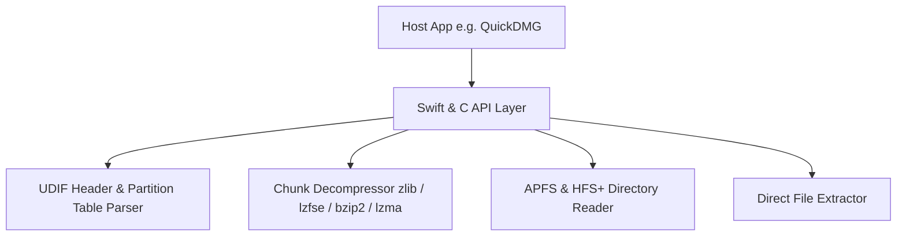

# System architecture

```mermaid
graph TD
    Client[Host App e.g. QuickDMG] --> API[Swift & C API Layer]
    API --> UDIF[UDIF Header & Partition Table Parser]
    API --> Decoder[Chunk Decompressor zlib / lzfse / bzip2 / lzma]
    API --> FS[APFS & HFS+ Directory Reader]
    API --> Writer[Direct File Extractor]
```
