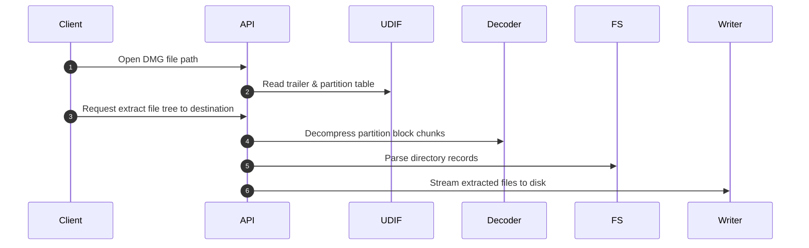

# Key flows

```mermaid
sequenceDiagram
    autonumber
    Client->>API: Open DMG file path
    API->>UDIF: Read trailer & partition table
    Client->>API: Request extract file tree to destination
    API->>Decoder: Decompress partition block chunks
    API->>FS: Parse directory records
    API->>Writer: Stream extracted files to disk
```
