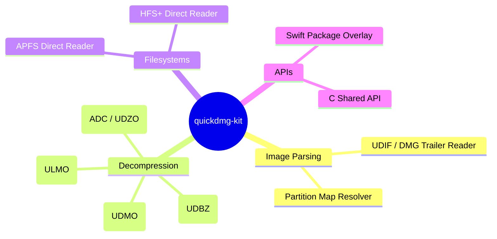

# Feature mindmap

```mermaid
mindmap
  root((quickdmg-kit))
    Image Parsing
      UDIF / DMG Trailer Reader
      Partition Map Resolver
    Decompression
      zlib (ADC / UDZO)
      bzip2 (UDBZ)
      lzfse (UDMO)
      lzma (ULMO)
    Filesystems
      APFS Direct Reader
      HFS+ Direct Reader
    APIs
      Swift Package Overlay
      C Shared API
```
